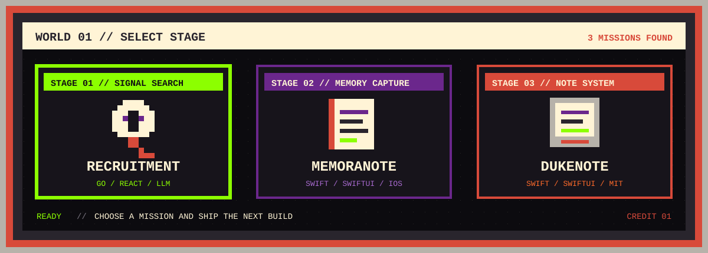
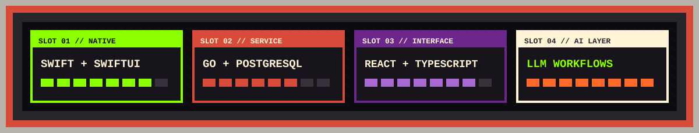

<picture>
  <source media="(max-width: 600px)" srcset="./assets/eva-profile-header-mobile.svg">
  
</picture>

<div align="center">

### `PLAYER 1 READY // 独立开发者 · INDEPENDENT DEVELOPER`

[中文档案](#player-file-cn--中文档案) · [English Profile](#player-file-en--english-profile) · [关卡选择](#stage-select--精选项目) · [装备栏](#loadout--系统栈)

<a href="https://github.com/Eileenes"></a>
<a href="mailto:dukeyeah@163.com"></a>


**把真实问题做成能长期运行的产品。**<br>
*Turning concrete problems into products built to keep running.*

</div>

---

## PLAYER FILE CN · 中文档案

你好，我是 **Duke Yeah**，一名独立开发者与产品工程师。

我喜欢从一个具体的工作流出发，独立完成需求梳理、交互设计、工程实现、部署维护和持续迭代。比起只做一个能演示的 Demo，我更在意软件是否真的好用、是否能稳定运行，以及它能不能减少人的重复劳动。

```text
PLAYER    DUKE YEAH
CLASS     独立开发者 / 产品工程师
MISSION   构建小而完整、有用且能交付的软件
STATUS    BUILDING...
```

- **AI 工作流**：让大模型进入真实任务，完成解析、搜索、排序、生成与自动推送
- **原生 iOS 工具**：用 Swift / SwiftUI 打磨安静、轻量、适合长期使用的记录产品
- **产品工程**：连接前端、后端、数据、部署与反馈，让想法形成完整闭环
- **个人效率软件**：从散乱信息和缓慢流程中，寻找值得被产品化的摩擦点

---

## PLAYER FILE EN · English Profile

Hi, I am **Duke Yeah**, an independent developer and product engineer.

I build product-shaped software end to end: framing the problem, designing the interaction, implementing the system, deploying it, and learning from real use. I care less about one-off demos and more about software that is useful, reliable, maintainable, and capable of removing repetitive work.

```text
PLAYER    DUKE YEAH
CLASS     INDEPENDENT DEVELOPER / PRODUCT ENGINEER
MISSION   BUILD SMALL, COMPLETE, USEFUL SOFTWARE
STATUS    BUILDING...
```

- **Applied AI workflows**: bringing LLMs into real tasks for parsing, search, ranking, generation, and automated delivery
- **Native iOS tools**: crafting quiet, focused, long-lived note products with Swift and SwiftUI
- **Product engineering**: connecting interface, backend, data, deployment, and feedback into one working loop
- **Personal software**: turning scattered information and slow routines into practical tools

---

## STAGE SELECT · 精选项目

<picture>
  <source media="(max-width: 600px)" srcset="./assets/retro-stage-select-mobile.svg">
  
</picture>

### STAGE 01 · [Recruitment](https://github.com/Eileenes/Recruitment)

> `GO` `REACT` `POSTGRESQL` `LLM` · **SIGNAL SEARCH MISSION**

面向招聘场景的 GitHub 人才线索发现工具：解析岗位需求、检索公开用户、排序仓库信号，并通过 Webhook 推送结果。

A GitHub lead finder for recruiting workflows, combining requirement parsing, public profile discovery, repository signal ranking, persistence, and webhook delivery.

[`▶ ENTER REPOSITORY`](https://github.com/Eileenes/Recruitment)

### STAGE 02 · [memoranote](https://github.com/Eileenes/memoranote)

> `SWIFT` `SWIFTUI` `IOS` · **MEMORY CAPTURE MISSION**

围绕记录、整理与笔记体验展开的个人产品，也是我持续打磨原生 iOS 工具体验的一条主线。

A product-driven note project and a long-running exploration of focused, native iOS tool experiences.

[`▶ ENTER REPOSITORY`](https://github.com/Eileenes/memoranote)

### STAGE 03 · [DukeNote](https://github.com/Eileenes/DukeNote)

> `SWIFT` `SWIFTUI` `MIT` · **NOTE SYSTEM MISSION**

原生 Notebook / 笔记项目，强调清晰结构、轻量交互与可长期维护的产品体验。

A native notebook project focused on clear structure, lightweight interaction, and maintainable product quality.

[`▶ ENTER REPOSITORY`](https://github.com/Eileenes/DukeNote)

---

## LOADOUT · 系统栈

<div align="center">


<br/>

<picture>
  <source media="(max-width: 600px)" srcset="./assets/eva-system-panel-mobile.svg">
  
</picture>

</div>

---

## CONTINUE? · 通讯频道

正在做 `AI 工具`、`iOS 产品`、`招聘系统` 或 `笔记 / 效率软件`？欢迎交流。

Building `AI tools`, `iOS products`, `recruiting systems`, or `note / productivity software`? Let us talk.

<div align="center">

### `PRESS START TO CONNECT`

[`GITHUB // Eileenes`](https://github.com/Eileenes) · [`EMAIL // dukeyeah@163.com`](mailto:dukeyeah@163.com)

<sub>DUKE SYSTEM © 1986–20XX // HUMAN × PRODUCT × MACHINE</sub>

</div>
