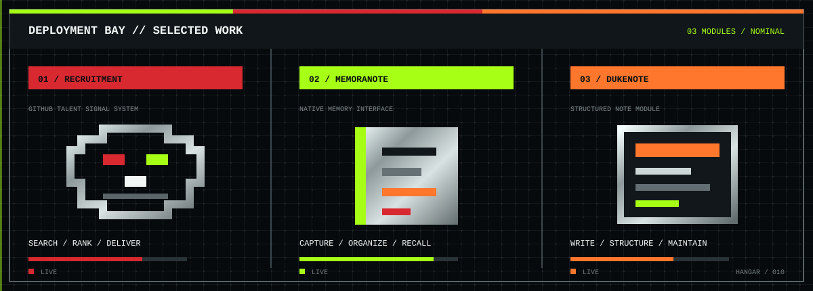
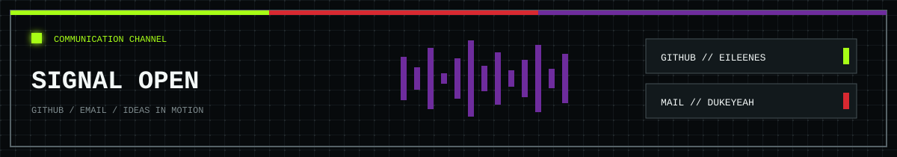

<picture>
  <source media="(max-width: 600px)" srcset="./assets/mecha-profile-header-mobile-v3.svg">
  
</picture>

### `EILEENES // DUKE YEAH`

**10 年产品经理 · 喜欢把想法亲手做出来**

[`个人介绍`](#个人介绍) · [`作品`](#作品) · [`联系我`](#联系我)

---

## 个人介绍

> **保持好奇，也保持动手。**

你好，我是 **Duke Yeah**，一名有 10 年经验的产品经理。

我对新事物总有兴趣，也喜欢亲手把想法做出来。遇到没试过的东西，我愿意先走近一点、体验一下，再形成自己的判断。工作之外，我认真生活，也把很多时间留给音乐。

`好奇 / 动手 / 体验 / 生活 / 音乐`

  
<strong>ENGLISH PROFILE // 展开英文介绍</strong>

   

  Hi, I am <strong>Duke Yeah</strong>, a product manager with 10 years of experience.

  I stay curious about new things and enjoy turning ideas into something tangible with my own hands. When I meet the unfamiliar, I prefer to try it first and form my own view through experience. Beyond work, I care deeply about living well and always make room for music.

   

  <code>CURIOUS / HANDS-ON / OPEN TO EXPERIENCE / LIFE / MUSIC</code>

---

## 作品

<picture>
  <source media="(max-width: 600px)" srcset="./assets/mecha-projects-mobile-v3.svg">
  
</picture>

### 01 / [Recruitment](https://github.com/Eileenes/Recruitment)

`Go` `React` `PostgreSQL` `LLM`

从岗位需求出发，在 GitHub 公开信息中发现人才线索，完成检索、信号排序与结果推送。

### 02 / [memoranote](https://github.com/Eileenes/memoranote)

`Swift` `SwiftUI` `iOS`

一款围绕记录与整理体验持续打磨的原生 iOS 笔记产品。

### 03 / [DukeNote](https://github.com/Eileenes/DukeNote)

`Swift` `SwiftUI` `MIT`

结构清晰、交互轻量的原生 Notebook 项目，适合长期记录与维护。

---

## 联系我

<picture>
  <source media="(max-width: 600px)" srcset="./assets/mecha-contact-panel-mobile-v3.svg">
  
</picture>

### `COMMUNICATION CHANNEL // OPEN`

[`GITHUB // Eileenes`](https://github.com/Eileenes) · [`EMAIL // dukeyeah@163.com`](mailto:dukeyeah@163.com)

STAY CURIOUS · MAKE THINGS · KEEP LIVING

