  

### `UNIT DY-01 // 独立开发者 · INDEPENDENT DEVELOPER`

[中文档案](#cn) · [English Profile](#en) · [作战单元](#units) · [系统栈](#stack)

---

## 中文档案 · PILOT FILE / CN

> **把真实问题，装配成可以长期运行的产品。**

你好，我是 **Duke Yeah**，一名独立开发者与产品工程师。

我喜欢从一个具体的工作流出发，独立完成需求梳理、交互设计、工程实现、部署维护和持续迭代。比起只做一个能演示的 Demo，我更在意软件是否真的好用、是否能稳定运行，以及它能不能减少人的重复劳动。

目前主要投入在：

- **AI 工作流**：让大模型进入真实任务，完成解析、搜索、排序、生成与自动推送
- **原生 iOS 工具**：用 Swift / SwiftUI 打磨安静、轻量、适合长期使用的记录产品
- **产品工程**：连接前端、后端、数据、部署与反馈，让想法形成完整闭环
- **个人效率软件**：从散乱信息和缓慢流程中，寻找值得被产品化的摩擦点

`当前任务：持续构建小而完整、有用且能交付的软件。`

---

## English Profile · PILOT FILE / EN

> **I turn concrete problems into products built to keep running.**

Hi, I am **Duke Yeah**, an independent developer and product engineer.

I build product-shaped software end to end: framing the problem, designing the interaction, implementing the system, deploying it, and learning from real use. I care less about one-off demos and more about software that is useful, reliable, maintainable, and capable of removing repetitive work.

My current focus:

- **Applied AI workflows**: bringing LLMs into real tasks for parsing, search, ranking, generation, and automated delivery
- **Native iOS tools**: crafting quiet, focused, long-lived note products with Swift and SwiftUI
- **Product engineering**: connecting interface, backend, data, deployment, and feedback into one working loop
- **Personal software**: turning scattered information and slow routines into practical tools

`Current directive: build small, complete, useful software — and ship it.`

---

## 作战单元 · ACTIVE UNITS

<table>
  <tr>
    <td width="50%" valign="top">
      <strong>UNIT 01 / Recruitment</strong>  
        
      <code>Go</code> <code>React</code> <code>PostgreSQL</code> <code>LLM</code>  
      面向招聘场景的 GitHub 人才线索发现工具：解析岗位需求、检索公开用户、排序仓库信号，并通过 Webhook 推送结果。  
      A GitHub lead finder for recruiting workflows, combining requirement parsing, public profile discovery, repository signal ranking, persistence, and webhook delivery.
    </td>
    <td width="50%" valign="top">
      <strong>UNIT 02 / memoranote</strong>  
        
      <code>Swift</code> <code>SwiftUI</code> <code>iOS</code>  
      围绕记录、整理与笔记体验展开的个人产品，也是我持续打磨原生 iOS 工具体验的一条主线。  
      A product-driven note project and a long-running exploration of focused, native iOS tool experiences.
    </td>
  </tr>
  <tr>
    <td width="50%" valign="top">
      <strong>UNIT 03 / DukeNote</strong>  
        
      <code>Swift</code> <code>SwiftUI</code> <code>MIT</code>  
      原生 Notebook / 笔记项目，强调清晰结构、轻量交互与可长期维护的产品体验。  
      A native notebook project focused on clear structure, lightweight interaction, and maintainable product quality.
    </td>
    <td width="50%" valign="top">
      <strong>UNIT 04 / NEXT SIGNAL</strong>  
        
      <code>Search</code> <code>Automation</code> <code>Product</code>  
      我持续寻找这些信号：信息过于分散、流程过于缓慢、重复劳动太多。它们通常就是新工具的起点。  
      I keep scanning for the same signals: scattered information, slow workflows, and repeated manual work. They are usually where the next useful tool begins.
    </td>
  </tr>
</table>

---

## 系统栈 · SYSTEM STACK

 

---

## 通讯频道 · COMMS

正在做 `AI 工具`、`iOS 产品`、`招聘系统` 或 `笔记 / 效率软件`？欢迎交流。

Building `AI tools`, `iOS products`, `recruiting systems`, or `note / productivity software`? Let us talk.

### `CHANNEL OPEN`

[`GITHUB // duke-yeah`](https://github.com/duke-yeah) · [`EMAIL // dukeyeah@163.com`](mailto:dukeyeah@163.com)

DY-01 // HUMAN × PRODUCT × MACHINE // BUILD LOG CONTINUES

