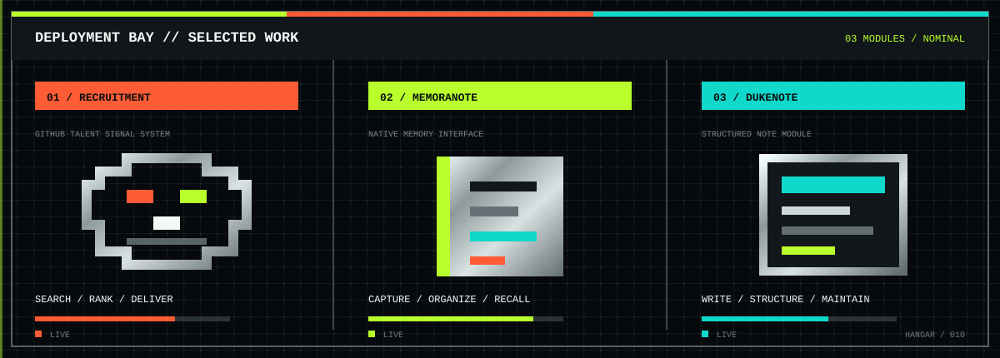
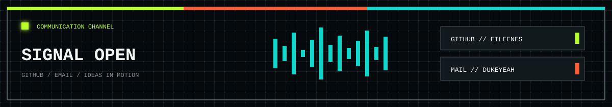

<picture>
  <source media="(max-width: 600px)" srcset="./assets/eva-profile-header-mobile.svg">
  
</picture>

### `EILEENES // DUKE YEAH`

**独立开发者 · 产品工程师 · AI 工作流 / 原生 iOS / 产品系统**

[个人介绍](#个人介绍) · [项目简述](#项目简述) · [联系方式](#联系方式)

  
<strong>ENGLISH PROFILE // 点击展开英文档案</strong>

   

  Hi, I am <strong>Duke Yeah</strong>, an independent developer and product engineer. I build product-shaped software from problem framing and interaction design to implementation, deployment, and iteration. My current focus is applied AI workflows, native iOS tools, and practical software that removes repetitive work.

   

  <strong>Selected projects</strong>

  - <a href="https://github.com/Eileenes/Recruitment"><strong>Recruitment</strong></a>: a GitHub lead finder combining requirement parsing, public profile discovery, repository signal ranking, persistence, and webhook delivery.
  - <a href="https://github.com/Eileenes/memoranote"><strong>memoranote</strong></a>: a focused native iOS note product built with Swift and SwiftUI.
  - <a href="https://github.com/Eileenes/DukeNote"><strong>DukeNote</strong></a>: a native notebook project focused on clear structure, lightweight interaction, and maintainable product quality.

   

  <strong>Contact</strong>: <a href="https://github.com/Eileenes">GitHub</a> · <a href="mailto:dukeyeah@163.com">Email</a>

---

## 个人介绍

> **把真实问题做成能长期运行的产品。**

你好，我是 **Duke Yeah**，一名独立开发者与产品工程师。

我喜欢从一个具体的工作流出发，独立完成需求梳理、交互设计、工程实现、部署维护和持续迭代。比起只做一个能演示的 Demo，我更在意软件是否真的好用、是否能稳定运行，以及它能不能减少人的重复劳动。

目前主要关注：

- **AI 工作流**：让大模型进入真实任务，完成解析、搜索、排序、生成与自动推送
- **原生 iOS 工具**：用 Swift / SwiftUI 打磨安静、轻量、适合长期使用的记录产品
- **产品工程**：连接前端、后端、数据、部署与反馈，让想法形成完整闭环

`UNIT-01 // BUILD` · `UNIT-02 // SHIP` · `UNIT-00 // ITERATE`

---

## 项目简述

<picture>
  <source media="(max-width: 600px)" srcset="./assets/eva-projects-mobile.svg">
  
</picture>

### UNIT-02 / [Recruitment](https://github.com/Eileenes/Recruitment)

`Go` `React` `PostgreSQL` `LLM`

面向招聘场景的 GitHub 人才线索发现工具：解析岗位需求、检索公开用户、排序仓库信号，并通过 Webhook 推送结果。

### UNIT-01 / [memoranote](https://github.com/Eileenes/memoranote)

`Swift` `SwiftUI` `iOS`

围绕记录、整理与笔记体验展开的个人产品，也是我持续打磨原生 iOS 工具体验的一条主线。

### UNIT-00 / [DukeNote](https://github.com/Eileenes/DukeNote)

`Swift` `SwiftUI` `MIT`

原生 Notebook / 笔记项目，强调清晰结构、轻量交互与可长期维护的产品体验。

---

## 联系方式

<picture>
  <source media="(max-width: 600px)" srcset="./assets/eva-contact-panel-mobile.svg">
  
</picture>

如果你也在做 `AI 工具`、`iOS 产品`、`招聘系统` 或 `笔记 / 效率软件`，欢迎交流。

### `COMMUNICATION CHANNEL OPEN`

[`GITHUB // Eileenes`](https://github.com/Eileenes) · [`EMAIL // dukeyeah@163.com`](mailto:dukeyeah@163.com)

HUMAN × PRODUCT × MACHINE // BUILD LOG CONTINUES

