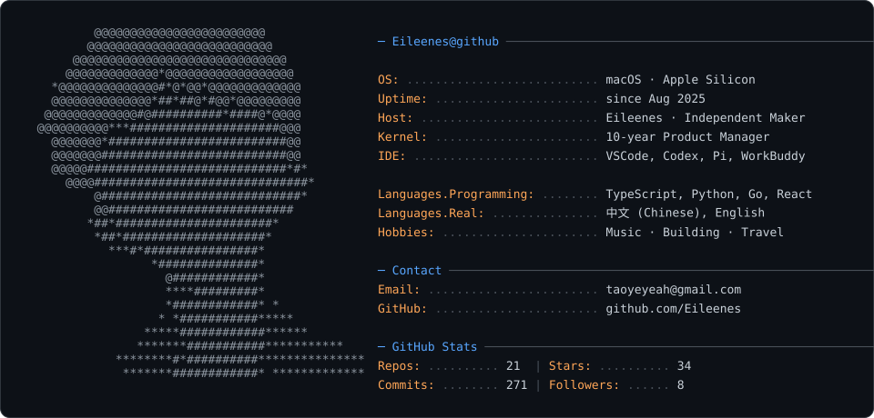

<picture>
  <source media="(prefers-color-scheme: dark)" srcset="dark_mode.svg">
  <source media="(prefers-color-scheme: light)" srcset="light_mode.svg">
  
</picture>

👆 这是我 GitHub 主页的「neofetch 风首屏卡片」。左侧是把我本人头像像素化后用 `@ / # / *` 字符堆叠出来的 ASCII；右侧展示设备栈与当前 GitHub 统计（Repos / Stars / Commits / Followers / Lines of Code），会根据你的系统主题自动切换深浅色。

  
<strong>ENGLISH // Show English caption</strong>

   
  👆 This is my <code>neofetch</code>-style header card. The left side is an ASCII rendering of my GitHub avatar (built from <code>@</code> / <code>#</code> / <code>*</code> pixels); the right side shows my device stack and live GitHub stats — Repos / Stars / Commits / Followers / Lines of Code — and it auto-switches between dark and light themes to match your system.

---

## 🔥 贡献热力图 / Contribution Graph

  

---

## 👋 关于我 / About Me

> **保持好奇，也保持动手。**

你好，我是 **Duke Yeah**，一名有 10 年经验的产品经理。我对新事物总有兴趣，也喜欢亲手把想法做出来。遇到没试过的东西，我愿意先走近一点、体验一下，再形成自己的判断。工作之外，我认真生活，也把很多时间留给音乐。

`好奇 / 动手 / 体验 / 生活 / 音乐`

  
<strong>ENGLISH // 展开英文介绍</strong>

   

  Hi, I'm **Duke Yeah**, a product manager with 10 years of experience.

  I stay curious about new things and enjoy turning ideas into something tangible with my own hands. When I meet the unfamiliar, I prefer to try it first and form my own view through experience. Beyond work, I care deeply about living well and always make room for music.

   

  <code>CURIOUS / HANDS-ON / OPEN TO EXPERIENCE / LIFE / MUSIC</code>

---

## 🚀 项目 / Projects

- **[LumaRouter](https://github.com/Eileenes/LumaRouter)** — 智能 LLM 网关，多模型智能路由 `Python`
- **[pi-desktop](https://github.com/Eileenes/pi-desktop)** — Pi 的桌面端应用 `TypeScript`
- **[pi](https://github.com/Eileenes/pi)** — AI Agent 工具集：统一 LLM API + Agent 框架
- **[QoderGuide](https://github.com/Eileenes/QoderGuide)** — Qoder 实战蓝皮书：教程 · 真实工作流 · Quest Mode

---

## 📫 联系我 / Contact

  <a href="https://github.com/Eileenes">GitHub</a> · <a href="mailto:dukeyeah@163.com">Email</a>

